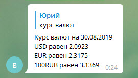

#Telegram bot
You can try it here: ***@itover9000_bot***

###What can do:
* Shows the current geomagnetic storm index  

* Shows the exchange rate of the NBRB against BYN  

* Helps you find things to do when you’re bored with translation en-ru  

* Shows a weather radar map with additional location mark on the map <http://meteoinfo.by/radar/>  
  
* Shows a weather radar animation for the last 3 hours <http://meteoinfo.by/radar/UMMN/radar-map.gif>  

####What technologies are used:
* Java 12
* Maven
* Spring Boot
* Lombok
* Log4j2
* Gson
* Junit 5
* Encryption Jasypt 
* Travis CI
* Codecov